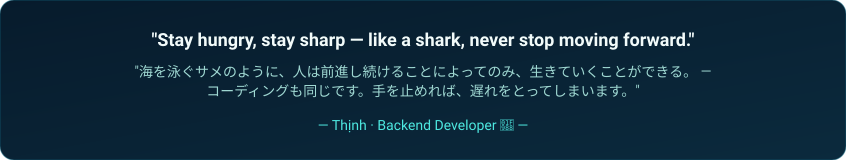

<!-- Nguyễn Ngô Thịnh — GitHub Profile -->

 

<h3 align="center"> Backend Developer · Frontend に関する基本的な理解 </h3>

  <em>サメのように、絶えず学び続けてください。泳ぐのをやめれば、沈んでしまうのですから。</em>

 

<h2 align="center"> Technologies and Tools </h2>
 

&nbsp;

&nbsp;

&nbsp;

&nbsp;

&nbsp;

&nbsp;

&nbsp;

&nbsp;

&nbsp;

&nbsp;

&nbsp;

&nbsp;

&nbsp;

## 私について
| | |
|---|---|
|  **学校** | 郵政通信技術学院（PTIT） |
|  **出身国** |ベトナム|
|  **専攻** |情報技術（IT） |
|  **性格** | 常に新しく斬新なものを求めている。 |
|  **外国語** | 私の英語と日本語はまだ完全に流暢とは言えませんが、日々上達しています。 |

 

 
<h2 align="center"> GitHub Stats </h2>
 

  
  

 

  

 
<h2 align="center"> Where to find me </h2>
 

  
  
  
  

 個人ウェブサイトは現在制作中です。まもなく更新予定です！

 
<h2 align="center"> My Favorite Quote </h2>
 

  

